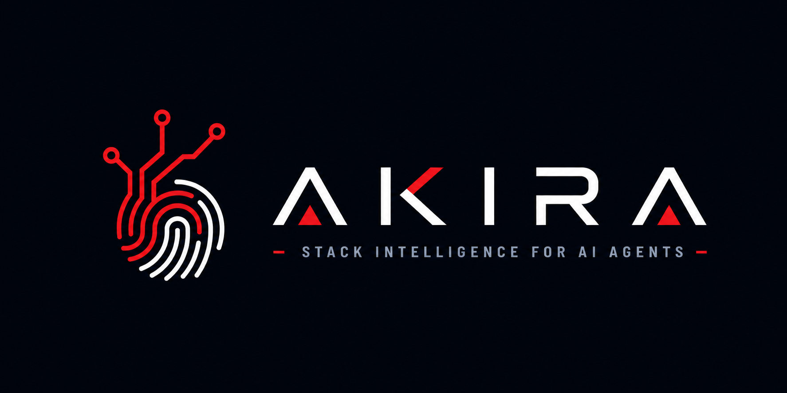

<p align="center">
  
</p>

<h1 align="center">Akira</h1>

<p align="center">
  Stack intelligence for AI agents.
</p>

<p align="center">
  <a href="https://pypi.org/project/akira/"></a>
  <a href="https://pypi.org/project/akira/"></a>
  <a href="LICENSE"></a>
  
</p>

Akira is a Python CLI that detects a project's stack, captures its coding
style, and generates agent-ready context files so AI coding agents can work
inside the repository's conventions.

It runs offline, writes inspectable Markdown, and does not depend on an LLM.

## Why Akira

AI agents are stronger when they understand the project before they edit it.
Akira turns local repository signals into durable context:

- Detects Python runtimes, frameworks, databases, test tools, CI, and tooling.
- Extracts a developer coding fingerprint from real source files.
- Generates Agent Skills with stack-aware guidance.
- Reviews detected stack metadata for compatibility and cleanup opportunities.
- Installs generated context into supported agent targets.

## Install

Install globally with `uv`:

```bash
uv tool install akira
```

Or install with `pip`:

```bash
pip install akira
```

Run without installing:

```bash
uvx akira detect
```

## Quick Start

```bash
akira detect --path .
akira fingerprint --path .
akira review --path .
akira craft --path .
```

Akira writes its generated artifacts to `.akira/` by default.

```text
.akira/
|-- stack.md
|-- fingerprint.md
`-- skills/
    |-- SKILL.md
    `-- python/
        |-- SKILL.md
        |-- web_framework/fastapi.md
        |-- testing/pytest.md
        |-- database/sqlalchemy.md
        |-- tooling/ruff.md
        `-- ...
```

## Commands

### `akira detect`

Scans a Python project, writes `.akira/stack.md`, generates matching skills,
and installs them for the selected agent.

```bash
akira detect --path . --agent claude-code --output .akira
```

Supported agent targets include `claude-code`, `cursor`, `copilot`, and
`codex`.

### `akira fingerprint`

Samples Python files and writes `.akira/fingerprint.md`.

```bash
akira fingerprint --path . --sample-size 20 --exclude tests/
```

### `akira review`

Reviews detected stack metadata for compatibility and best-practice findings.

```bash
akira review --path .
akira review --path . --strict
```

Safe metadata-only changes can be accepted interactively or with
`--auto-apply`.

### `akira craft`

Installs previously generated Akira artifacts into the selected agent context.

```bash
akira craft --path . --agent claude-code --output .akira
```

## Generated Artifacts

| Artifact | Purpose |
| --- | --- |
| `.akira/stack.md` | Detected runtime, frameworks, databases, testing, tooling, infrastructure, CI, and active skills. |
| `.akira/fingerprint.md` | Style signals such as spacing, naming, imports, typing, comments, docstrings, control flow, error handling, and strings. |
| `.akira/skills/` | Agent Skills with YAML frontmatter and Markdown guidance generated from templates. |

Example outputs are available in [`docs/examples/stack.md`](docs/examples/stack.md),
[`docs/examples/fingerprint.md`](docs/examples/fingerprint.md), and
[`docs/examples/skills/`](docs/examples/skills/).

## Scope

Akira v1.0 is intentionally narrow:

- Python ecosystem detection.
- Four CLI commands: `detect`, `fingerprint`, `review`, and `craft`.
- Offline stack and style analysis.
- Template-based skill generation.
- Local agent skill installation.

Roadmap items include LLM enrichment, multi-language detectors, watch mode,
hosted documentation, and MCP server behavior.

## Development

Create the development environment:

```bash
uv sync --extra dev
```

Run the full test suite:

```bash
uv run pytest
```

Useful focused checks:

```bash
uv run pytest tests/test_detect
uv run pytest tests/test_fingerprint
uv run pytest tests/test_skills
uv run ruff check .
```

Run the CLI from the working tree:

```bash
uv run akira detect --path tests/fixtures/fastapi_project --output .akira
uv run akira fingerprint --path tests/fixtures/style_projects/consistent --output .akira
```

## Release

Manual validation targets live in [`docs/VALIDATION.md`](docs/VALIDATION.md).
Release build, install, smoke-test, fallback package-name, and publish steps
live in [`docs/RELEASE.md`](docs/RELEASE.md).

## License

Akira is released under the [MIT License](LICENSE).
